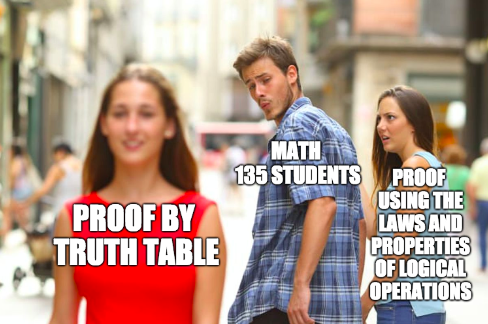
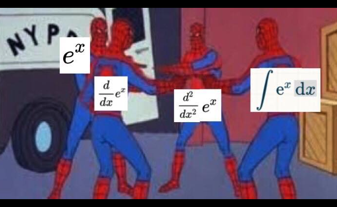
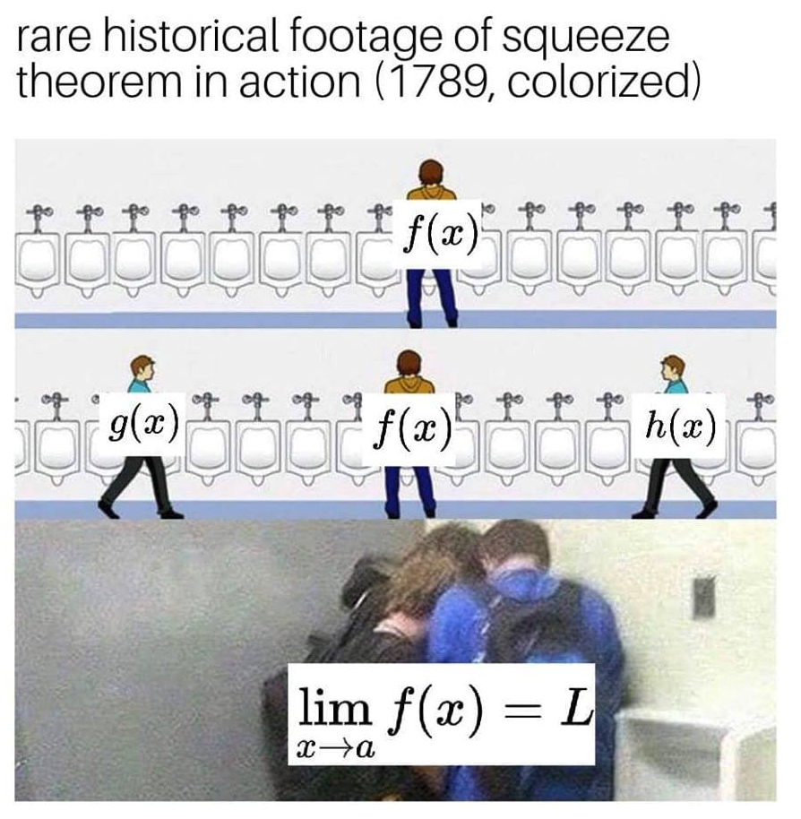
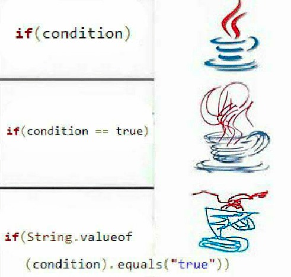
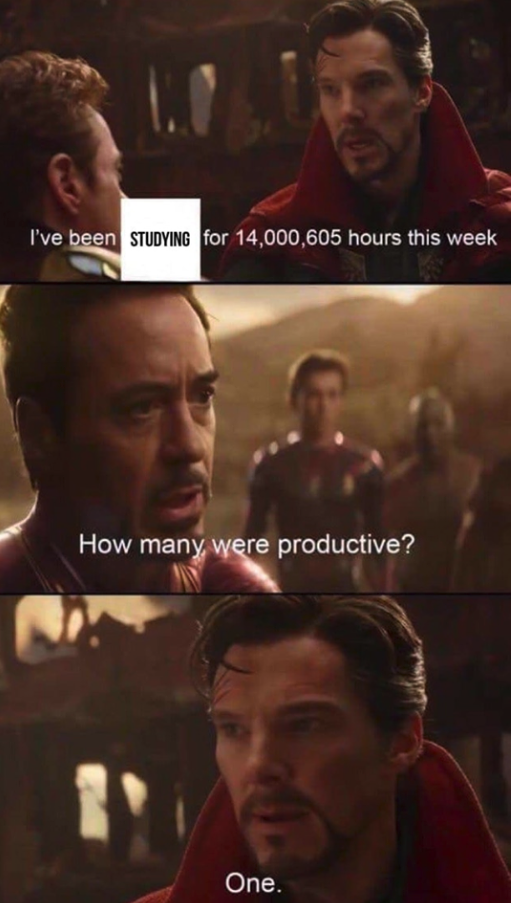

Hope you had a great first 2 weeks of school! I'm Cindy Wang, and I'm really looking forward to working with you and MathSoc this year. I am already an academic rep for software engineering and have led several clubs in high school. Memes aside, here's what I'd like to do to improve our first-year experience:

## 1. Academic help:  

University math classes can be very different from what we're used to in high school, and I will hold drop-in group study sessions and convey your concerns to math professors. Also, I plan to organize resume critiques or co-op advising with the upper years so you can get a better idea of what jobs to apply for. Finally, I hope to help reduce exam stress with healthy snacks, study tips, or yoga/meditation workshops in exam season.

## 2. Networking and community: 

With so many people in the Math faculty, and everyone in different classes and co-op streams, it's hard to get to know people. Life is a lot better with friends and a good support network, and I will plan events like socials, game nights, or math dance parties to help you meet new people from different years and programs, or have fun with your friends. As a long-time follower of MathSoc's social media, I am familiar with the types of events being run, and hope to make them even better this year.

## 3. Transparency and representation: 
I will make the content of MathSoc meetings more accessible to everyone so that you will know if we are fulfilling our promises. Plus, I believe that everyone's opinions and unique perspectives should be considered when making decisions; I will send online surveys and have suggestion boxes so that your voice will be represented.

I'm so excited to get to know you and work together to make our once in a lifetime first-year experience the best that it can be!

### Mr. Goose is watching you... especially on September 20-21.

# [Vote Now!](https://tinyurl.com/mathsocvote)

## Memes!

